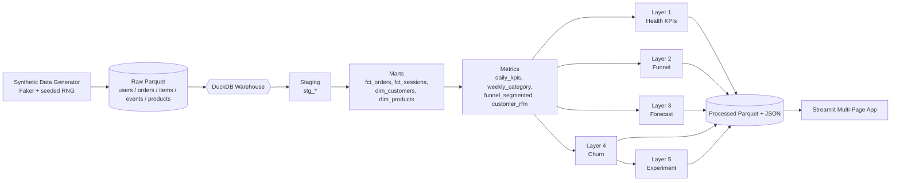

# 📈 PulseCommerce — End-to-End SMB Commerce Intelligence Platform

> One unified warehouse. Five analytical layers. One coherent story that answers:
> **Is the business healthy → where is it leaking → what's coming → who's leaving → what should we do?**

[](https://github.com/kelvinasiedu/pulsecommerce/actions/workflows/ci.yml)
[](https://www.python.org/)
[](LICENSE)
[](https://streamlit.io/cloud)
[](https://www.docker.com/)

---

## What this is

PulseCommerce is a production-styled analytics platform for a fictional small-to-medium ecommerce brand. It takes a single source of truth (a thelook-style transactional dataset) and exposes five analytical capabilities that build on each other:

| # | Layer | Question answered | Key techniques |
|---|---|---|---|
| 1 | **Business Health** | Is the business healthy? | SQL KPI design, period-over-period, rolling windows |
| 2 | **Funnel Drop-off** | Where do we lose customers? | 5-stage event funnel, segment conversion, lost-revenue quantification |
| 3 | **Demand Forecast** | What's coming next? | Seasonal-naive vs Holt-Winters vs XGBoost, walk-forward backtest, MAPE selection |
| 4 | **Churn Risk** | Who's about to leave? | RFM features, logistic + XGBoost, ROC-AUC, cohort retention |
| 5 | **Experiment Readout** | Did the intervention work? | Simulated A/B, Welch t-test, guardrail metrics, ship/iterate/reject |

The narrative: *the dashboard flags a conversion drop → the funnel page localizes it → the churn model identifies who's at risk → the forecast quantifies revenue at stake → the experiment page delivers a ship-ready readout.*

---

## 🚀 Quick start

### Option A — local Python
```bash
git clone https://github.com/kelvinasiedu/pulsecommerce.git
cd pulsecommerce

python -m venv .venv && source .venv/bin/activate   # or .venv\Scripts\activate on Windows
pip install -r requirements-dev.txt
pip install -e .

# one command: generate data + build warehouse + run all 5 layers
python -m pulsecommerce.cli all

# launch the dashboard
streamlit run dashboard/Home.py
```

Open `http://localhost:8501`.

### Option B — Docker
```bash
docker compose up --build
# open http://localhost:8501
```

### Option C — Makefile
```bash
make install-dev
make generate warehouse pipeline
make app
```

---

## 🏗️ Architecture



### Repo layout

```
pulsecommerce/
├── src/pulsecommerce/          # Python package
│   ├── config.py               # paths, dataset params, model settings
│   ├── warehouse.py            # DuckDB adapter
│   ├── pipeline.py             # orchestrates all 5 layers
│   ├── cli.py                  # `pulsecommerce generate|warehouse|pipeline|all`
│   ├── data/generator.py       # synthetic dataset with seasonality + funnel + cohorts
│   └── analytics/
│       ├── health.py           # Layer 1
│       ├── funnel.py           # Layer 2
│       ├── forecast.py         # Layer 3 (Seasonal-naive, Holt-Winters, XGBoost)
│       ├── churn.py            # Layer 4 (Logistic + XGBoost, RFM features)
│       └── experiment.py       # Layer 5 (Welch t-test + guardrails)
├── sql/
│   ├── staging/                # stg_users, stg_orders, stg_order_items, stg_events, stg_products
│   ├── marts/                  # fct_orders, fct_sessions, dim_customers, dim_products
│   └── metrics/                # daily_kpis, weekly_category, funnel_segmented, customer_rfm
├── dashboard/                  # Streamlit multi-page app
│   ├── Home.py
│   └── pages/
├── tests/                      # pytest suite (data, warehouse, analytics, CLI)
├── docs/
│   ├── kpi_dictionary.md
│   ├── methodology.md
│   └── executive_memo.md
├── .github/workflows/ci.yml    # lint + types + tests on 3 Python versions
├── Dockerfile / docker-compose.yml
├── Makefile
├── pyproject.toml / requirements*.txt
└── README.md
```

---

## 🧪 Dataset

Production-grade analytics needs production-grade data. Because BigQuery's `thelook_ecommerce` requires GCP auth, PulseCommerce ships a **deterministic synthetic generator** that matches its schema and behaviour:

- **~25k users · 800 products · 95k orders · ~450k clickstream events** (default config)
- **Weekly + annual seasonality** (sine waves + Q4 holiday boost)
- **Segment-dependent funnel friction** (device × channel conversion asymmetry)
- **Repeat-buyer skew** via Zipf sampling
- **Cohort retention decay** so Layer 4's model actually has signal
- Fully reproducible via `--seed`

Run `python -m pulsecommerce.cli generate --small` for a CI-sized dataset (~2.5k users).

---

## 📊 KPI framework

See [`docs/kpi_dictionary.md`](docs/kpi_dictionary.md) for the full catalogue of metrics, owners, and SQL sources. Every chart in the dashboard ultimately joins back to this dictionary — so there is one definition of "revenue" across all five layers.

---

## 🧰 Stack

| Layer | Tool | Why |
|---|---|---|
| Warehouse | **DuckDB** | Zero-config, SQL-native, ships in the wheel — perfect for portfolio + Streamlit Cloud |
| Transformations | **SQL (layered: staging → marts → metrics)** | Industry-standard dbt-style structure, but no external service |
| Modeling | **scikit-learn, XGBoost, statsmodels** | Gradient boosting + interpretable baselines + classical time series |
| Dashboard | **Streamlit + Plotly** | Multi-page app, deployable for free to Streamlit Cloud |
| Quality | **pytest, ruff, mypy, pre-commit** | Professional Python engineering signal |
| CI/CD | **GitHub Actions** | Matrix build on Python 3.10/3.11/3.12 |
| Runtime | **Docker + docker-compose** | Reproducible deploy |

---

## ✅ Testing & quality

```bash
make ci           # ruff + mypy + pytest with coverage
make test         # pytest only
make lint         # ruff
make typecheck    # mypy
```

The test suite builds a *tiny* warehouse in-memory and exercises every analytical layer end-to-end — catching SQL bugs, feature-engineering regressions, and CLI drift in one pass.

---

## ☁️ Deploy to Streamlit Cloud

1. Push this repo to GitHub
2. Go to [share.streamlit.io](https://share.streamlit.io) → **New app**
3. Point it at `dashboard/Home.py`, Python 3.12
4. Streamlit Cloud will `pip install -r requirements.txt`. On first boot, call the CLI to bootstrap data:

   Either add an `app.py` wrapper that runs `pulsecommerce all` on cold start, or pre-commit the built `data/warehouse/pulse.duckdb` to the repo (gitignored by default — override if you want a zero-boot app).

A ready-to-use deployment workflow is documented in [`docs/DEPLOY.md`](docs/DEPLOY.md).

---

## 📄 Documentation

- [`docs/kpi_dictionary.md`](docs/kpi_dictionary.md) — metric definitions and owners
- [`docs/methodology.md`](docs/methodology.md) — modeling choices, backtest protocol, guardrail philosophy
- [`docs/executive_memo.md`](docs/executive_memo.md) — 1-page stakeholder readout
- [`docs/DEPLOY.md`](docs/DEPLOY.md) — deployment runbook

---

## 📋 Resume bullets

> **PulseCommerce — End-to-end SMB commerce intelligence platform** *(Python · SQL · DuckDB · scikit-learn · XGBoost · Streamlit · Docker)*
> - Built a unified analytics platform on 450k+ ecommerce events and 95k orders spanning KPI reporting, funnel analysis, demand forecasting, churn prediction, and experiment readouts
> - Designed a layered SQL warehouse (staging → marts → metrics) producing a single source of truth consumed by 4 downstream analytical modules
> - Implemented weekly demand forecasting with Seasonal-Naive, Holt-Winters, and XGBoost models; selected winners per category via walk-forward MAPE backtesting
> - Trained a churn-risk model (ROC-AUC ~0.85) on RFM + behavioral + cohort features, and fed high-risk customers into a simulated A/B experiment with Welch t-tests and guardrail metrics
> - Delivered a 5-page Streamlit dashboard, Dockerized runtime, GitHub Actions CI, and a KPI dictionary — connecting predictive outputs to concrete product, marketing, and ops actions

---

## 📜 License

MIT © Kelvin Asiedu
