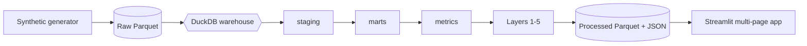

# PulseCommerce

A portfolio analytics app that takes a synthetic ecommerce dataset and works
through five questions on top of it: is the business healthy, where does the
funnel leak, what does demand look like next, who is about to churn, and did
the last A/B test actually move the needle.

Live demo: [kelvin-programmer-pulsecommerce.hf.space](https://kelvin-programmer-pulsecommerce.hf.space)

[](https://github.com/kelvinasiedu-programmer/pulsecommerce/actions/workflows/ci.yml)

## What's in it

| # | Page | Question | Approach |
|---|---|---|---|
| 1 | Business Health | Is the business healthy? | SQL KPIs, period-over-period, rolling windows |
| 2 | Funnel | Where do we lose customers? | 5-stage event funnel, segment conversion, lost-revenue estimate |
| 3 | Forecast | What's coming next? | Seasonal-naive vs Holt-Winters vs XGBoost, walk-forward MAPE |
| 4 | Churn | Who's about to leave? | RFM features, logistic + XGBoost, ROC-AUC, cohort retention |
| 5 | Experiment | Did the intervention work? | Simulated A/B, Welch t-test, guardrail metrics |

Every page reads from the same DuckDB warehouse and the same KPI dictionary,
so "revenue" means the same thing on the churn page as it does on the home
page.

## Run it

```bash
git clone https://github.com/kelvinasiedu-programmer/pulsecommerce.git
cd pulsecommerce

python -m venv .venv && source .venv/bin/activate   # Windows: .venv\Scripts\activate
pip install -r requirements-dev.txt
pip install -e .

# generate data + build warehouse + run all 5 layers
python -m pulsecommerce.cli all

# launch the dashboard
streamlit run dashboard/Home.py
```

Open `http://localhost:8501`. `docker compose up --build` works too.

For a smaller CI-sized dataset, `python -m pulsecommerce.cli generate --small`
gives you ~2.5k users instead of the default ~25k.

## How the data flows



SQL is split into `staging → marts → metrics`, which is the layout I'd use
with dbt in a real setup.

## Dataset

The public `thelook_ecommerce` table on BigQuery needs GCP auth, so I wrote a
deterministic generator that matches its schema:

- ~25k users, 800 products, 95k orders, ~450k clickstream events
- Weekly and annual seasonality (sine waves plus a Q4 holiday boost)
- Segment-dependent funnel friction (device × channel conversion asymmetry)
- Zipf-sampled repeat-buyer skew
- Cohort retention decay so the churn model has something to learn
- Reproducible via `--seed`

## Repo layout

```
pulsecommerce/
├── src/pulsecommerce/
│   ├── warehouse.py            # DuckDB adapter
│   ├── pipeline.py             # orchestrates the 5 layers
│   ├── cli.py                  # pulsecommerce generate|warehouse|pipeline|all
│   ├── data/generator.py       # synthetic dataset
│   └── analytics/
│       ├── health.py
│       ├── funnel.py
│       ├── forecast.py         # Seasonal-naive, Holt-Winters, XGBoost
│       ├── churn.py            # Logistic + XGBoost, RFM features
│       └── experiment.py       # Welch t-test + guardrails
├── sql/                        # staging / marts / metrics
├── dashboard/                  # Streamlit multi-page app
├── tests/
├── docs/
└── .github/workflows/ci.yml
```

## Stack

DuckDB for the warehouse (zero-config, SQL-native, bundles into the wheel),
layered SQL transformations, scikit-learn + XGBoost + statsmodels for
modelling, Streamlit + Plotly for the dashboard, pytest / ruff / mypy, and
GitHub Actions for CI across Python 3.10–3.12. Docker for reproducible
deploy.

## Tests

```bash
make ci           # ruff + mypy + pytest with coverage
make test         # pytest only
```

The suite builds a tiny warehouse in-memory and exercises every page
end-to-end, which is the only way to catch SQL drift and CLI regressions in
one pass.

## Docs

- [`docs/kpi_dictionary.md`](docs/kpi_dictionary.md) — metric definitions
- [`docs/methodology.md`](docs/methodology.md) — modelling choices, backtest protocol, guardrail philosophy
- [`docs/executive_memo.md`](docs/executive_memo.md) — one-page stakeholder readout
- [`docs/DEPLOY.md`](docs/DEPLOY.md) — deployment notes

## Limitations

- The dataset is synthetic, so the findings are illustrative — the point is
  the plumbing, not the numbers.
- The forecast uses a heuristic prediction interval; conformal methods would
  be the next step before anyone bet stock levels on it.
- The "experiment" is simulated on historical windows; a real rollout would
  need a live assignment mechanism.

## License

MIT © Kelvin Asiedu
