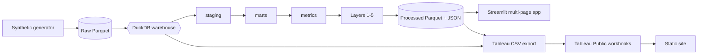

---
title: PulseCommerce
emoji: 📈
colorFrom: indigo
colorTo: purple
sdk: docker
app_port: 7860
pinned: false
short_description: Ecommerce analytics - forecasting, churn, A/B testing
---

# PulseCommerce

A portfolio analytics app that takes a synthetic ecommerce dataset and works
through five questions on top of it: is the business healthy, where does the
funnel leak, what does demand look like next, who is about to churn, and did
the last A/B test actually move the needle.

Three of the five are published as interactive Tableau Public dashboards on a
static site; all five run in the Python app.

- Dashboards: `site/` (see [`site/README.md`](site/README.md) to deploy)
- Python app: [kelvin-programmer-pulsecommerce.hf.space](https://kelvin-programmer-pulsecommerce.hf.space)

[](https://github.com/kelvinasiedu-programmer/pulsecommerce/actions/workflows/ci.yml)

## What's in it

| # | Page | Question | Approach |
|---|---|---|---|
| 1 | Business Health | Is the business healthy? | SQL KPIs, period-over-period, rolling windows |
| 2 | Funnel | Where do we lose customers? | 5-stage event funnel, segment conversion, lost-revenue estimate |
| 3 | Forecast | What's coming next? | Seasonal-naive vs Holt-Winters vs XGBoost, walk-forward MAPE |
| 4 | Churn | Who's about to leave? | RFM features, logistic + XGBoost, ROC-AUC, cohort retention |
| 5 | Experiment | Did the intervention work? | Simulated A/B, Welch t-test, guardrail metrics |

Every page reads from the same DuckDB warehouse and the same KPI dictionary,
so "revenue" means the same thing on the churn page as it does on the home
page.

## Run it

```bash
git clone https://github.com/kelvinasiedu-programmer/pulsecommerce.git
cd pulsecommerce

python -m venv .venv && source .venv/bin/activate   # Windows: .venv\Scripts\activate
pip install -r requirements-dev.txt
pip install -e .

# generate data + build warehouse + run all 5 layers
python -m pulsecommerce.cli all

# launch the dashboard
streamlit run dashboard/Home.py
```

Open `http://localhost:8501`. `docker compose up --build` works too.

DuckDB and file-syncing folders don't mix - the lock file confuses OneDrive and
Dropbox and you get intermittent corruption. If the repo lives in a synced
folder, put the runtime data somewhere local first:

```powershell
$env:PULSECOMMERCE_DATA_DIR = "C:\dev\pulsecommerce-data"
```

`PULSECOMMERCE_WAREHOUSE_PATH` overrides the DuckDB file location on its own if
you need finer control.

For the Tableau side:

```bash
python -m pulsecommerce.cli tableau      # writes data/tableau/*.csv
python -m http.server 8000 --directory site
```

[`tableau/BUILD.md`](tableau/BUILD.md) has the workbook build steps.

For a smaller CI-sized dataset, `python -m pulsecommerce.cli generate --small`
gives you ~2.5k users instead of the default ~25k.

## How the data flows


```mermaid
flowchart LR
    A[Synthetic generator] --> B[(Raw Parquet)]
    B --> C{{DuckDB warehouse}}
    C --> D[staging]
    D --> E[marts]
    E --> F[metrics]
    F --> G[Layers 1-5]
    G --> H[(Processed Parquet + JSON)]
    H --> I[Streamlit multi-page app]
    C --> J[Tableau CSV export]
    H --> J
    J --> K[Tableau Public workbooks]
    K --> L[Static site]
```

SQL is split into `staging → marts → metrics`, which is the layout I'd use
with dbt in a real setup.

## Dataset

The public `thelook_ecommerce` table on BigQuery needs GCP auth, so I wrote a
deterministic generator that matches its schema:

- ~25k users, 800 products, ~617k sessions, ~1.18M clickstream events, ~22k orders
- The clickstream is the source of truth. Sessions walk the funnel and every
  session reaching the purchase stage emits exactly one order, so "4.1%
  conversion" and "22k orders" are the same statement rather than two unrelated
  ones
- Weekly and annual seasonality (sine waves plus a Q4 holiday boost), applied to
  sessions so it flows through to orders
- Segment-dependent funnel friction (device × channel conversion asymmetry)
- Zipf-Mandelbrot per-user propensity, which drives the repeat-buyer skew
- Sessions are confined to a user's lifetime, so cohort retention is not
  measuring purchases that happened before the account existed
- Reproducible via `--seed`

`n_orders` in `DataGenConfig` is a target rather than an exact count: the
generator back-solves session volume from the funnel's mix-weighted conversion
rate, and about 12% of purchases are later cancelled or returned.

## Repo layout

```
pulsecommerce/
├── src/pulsecommerce/
│   ├── warehouse.py            # DuckDB adapter
│   ├── pipeline.py             # orchestrates the 5 layers
│   ├── cli.py                  # generate|warehouse|pipeline|all|tableau
│   ├── data/generator.py       # synthetic dataset
│   ├── exports/tableau.py      # flattens the warehouse to CSV for Tableau
│   └── analytics/
│       ├── health.py
│       ├── funnel.py
│       ├── forecast.py         # Seasonal-naive, Holt-Winters, XGBoost
│       ├── churn.py            # Logistic + XGBoost, RFM features
│       └── experiment.py       # Welch t-test + guardrails
├── sql/                        # staging / marts / metrics
├── dashboard/                  # Streamlit multi-page app
├── site/                       # static site embedding the Tableau workbooks
├── tableau/BUILD.md            # how the workbooks are built
├── tests/
├── docs/
└── .github/workflows/ci.yml
```

## Stack

DuckDB for the warehouse (zero-config, SQL-native, bundles into the wheel),
layered SQL transformations, scikit-learn + XGBoost + statsmodels for
modeling, Streamlit + Plotly for the Python app, Tableau Public for the
published dashboards, pytest / ruff / mypy, and GitHub Actions for CI across
Python 3.10-3.12. Docker for reproducible deploy.

## Tests

```bash
make ci           # ruff + mypy + pytest with coverage
make test         # pytest only
```

The suite builds a tiny warehouse in-memory and exercises every page
end-to-end, which is the only way to catch SQL drift and CLI regressions in
one pass.

## Docs

- [`docs/kpi_dictionary.md`](docs/kpi_dictionary.md) - metric definitions
- [`docs/methodology.md`](docs/methodology.md) - modeling choices, backtest protocol, guardrail philosophy
- [`docs/executive_memo.md`](docs/executive_memo.md) - one-page stakeholder readout
- [`docs/DEPLOY.md`](docs/DEPLOY.md) - deployment notes

## Limitations

- The dataset is synthetic, so the findings are illustrative - the point is
  the plumbing, not the numbers.
- The forecast uses a heuristic prediction interval; conformal methods would
  be the next step before anyone bet stock levels on it.
- The "experiment" is simulated on historical windows; a real rollout would
  need a live assignment mechanism.

## License

MIT © Kelvin Asiedu
